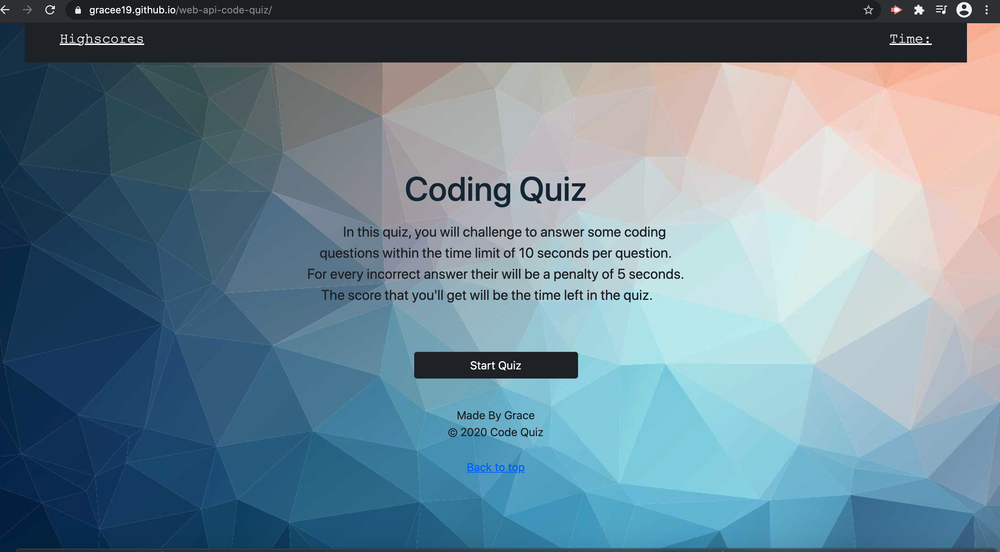
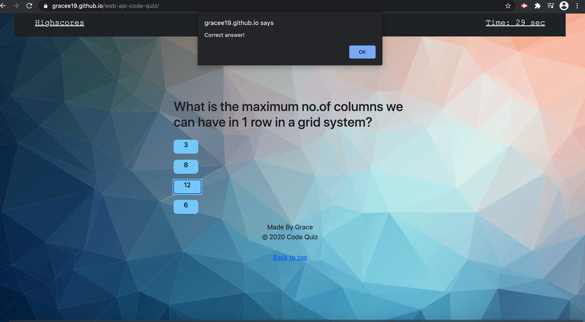
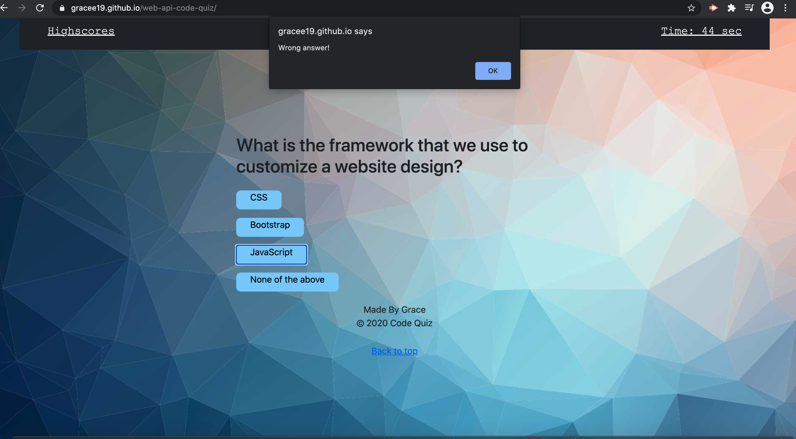
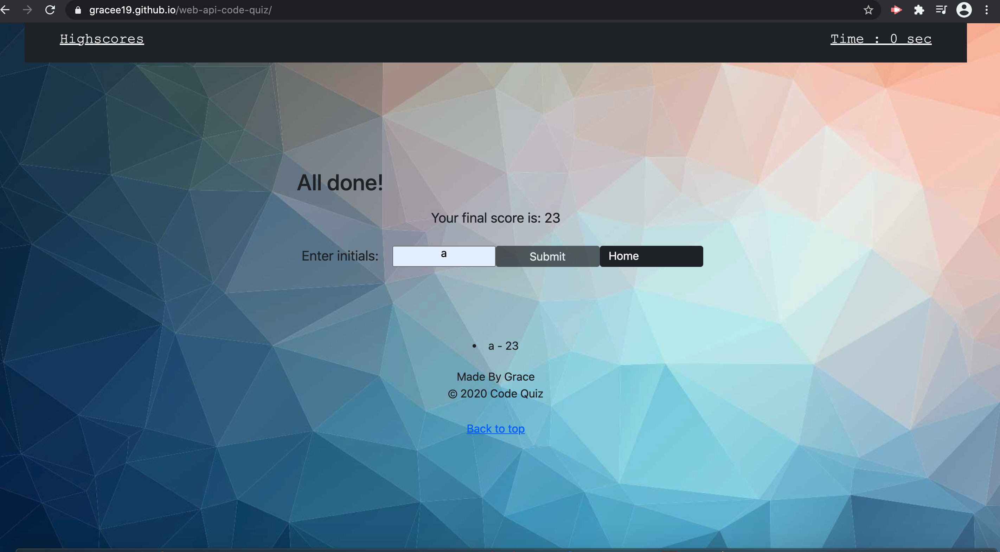

# web-api-code-quiz
In this project, I was able to create a Code quiz using javascript,css and html.
In this webpage, it shows the use of arrays, If- Else Statement, Variables, Function,Strings and on the process of making a timer.

Click the link below to see the working webpage of my project.

[Code Quiz](https://gracee19.github.io/web-api-code-quiz/)

Also I have embedded some images of the pages itself.

